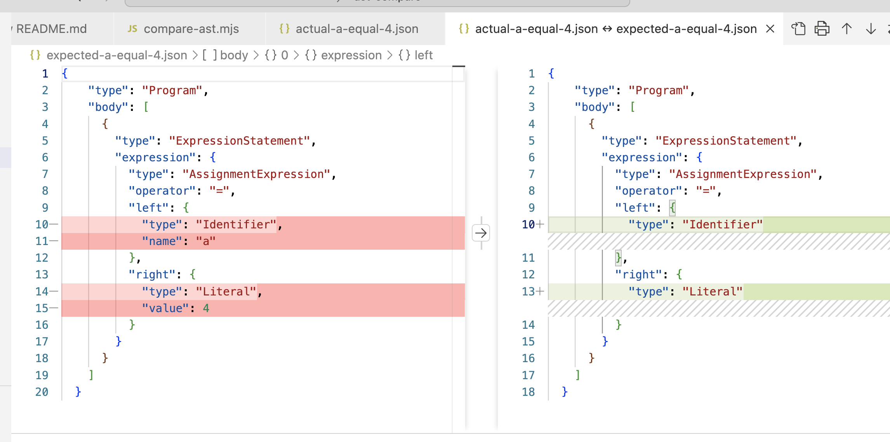

# AST comparison

You can compare ASTs in different ways: 

- Use VSCode "select to compare" feature to compare the JSON files. Likely one of the best.
  
  
- Use the npm package `json-diff-kit` to compare JSON files.
- Use the `check` method of ast-type nodes to check consistency of the AST.
- Use an ordinary `diff` tool to compare JSON files.
  
  ```diff
  ➜  ast-compare git:(main) diff actual-a-equal-4.json expected-a-equal-4.json 
    10,11c10
    <             "type": "Identifier",
    <             "name": "a"
    ---
    >             "type": "Identifier"
    14,15c13
    <             "type": "Literal",
    <             "value": 4
    ---
    >             "type": "Literal"
    ```
- Another way to compare JSON files is to use the website https://www.jsondiff.com/.
- Use the npm package [ast-compare](ast-compare.md) to compare ASTs. 
- Use the npm package [json-diff](json-diff.md) to compare JSON files.
  
## json-diff-kit

```
➜  ast-compare git:(main) ✗ npx jsondiff --help
Usage: jsondiff [options] [command]

A better JSON differ & viewer, support LCS diff for arrays and recognise some changes as "modification" apart from simple "remove"+"add".

Options:
  -V, --version                   output the version number
  -h, --help                      display help for command

Commands:
  run [options] <before> <after>  Shows a difference between two JSON files.
  help [command]                  display help for command
```


